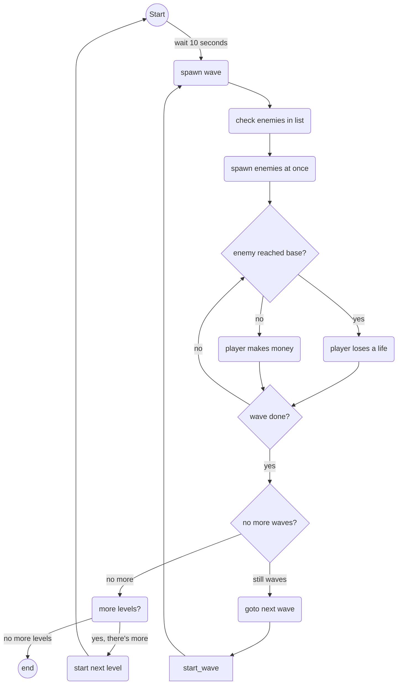
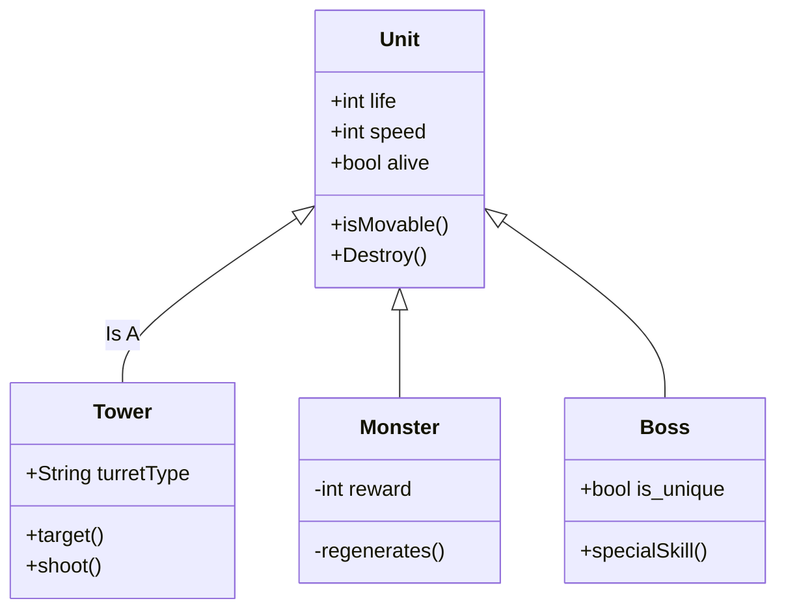

# Magical Doctor - Pretty Clinic
Eliza:
  * [Grid Generation](https://github.com/Wispyru/MagicalDoctorPrettyClinic/wiki/Full-code-documentation#grid-generation)
  * [Grid Tile Swapping](https://github.com/Wispyru/MagicalDoctorPrettyClinic/wiki/Full-code-documentation#grid-tile-swapping)
  * [Medicine Match](https://github.com/Wispyru/MagicalDoctorPrettyClinic/wiki/Full-code-documentation#medicine-match)
  * [Medicine Data](https://github.com/Wispyru/MagicalDoctorPrettyClinic/wiki/Full-code-documentation#medicine-data)
  * [Medicine Select](https://github.com/Wispyru/MagicalDoctorPrettyClinic/wiki/Full-code-documentation#medicine-select)
  * [Medicine Type](https://github.com/Wispyru/MagicalDoctorPrettyClinic/wiki/Full-code-documentation#medicine-type)
  * [Game Data](https://github.com/Wispyru/MagicalDoctorPrettyClinic/wiki/Full-code-documentation#game-data)
  * [Swap Scene](https://github.com/Wispyru/MagicalDoctorPrettyClinic/wiki/Full-code-documentation#swap-scene)
  * [Level Data Loading](https://github.com/Wispyru/MagicalDoctorPrettyClinic/wiki/Full-code-documentation#level-data-loading)
  * [Gameplay Timer](https://github.com/Wispyru/MagicalDoctorPrettyClinic/wiki/Full-code-documentation#GameplayTimer)
  * [Swap Scene](https://github.com/Wispyru/MagicalDoctorPrettyClinic/wiki/Full-code-documentation#SwapScene)

Kees:
  * [Grid Generation](https://github.com/Wispyru/MagicalDoctorPrettyClinic/wiki/Full-code-documentation#grid-generation)
  * [Grid Tile Swapping](https://github.com/Wispyru/MagicalDoctorPrettyClinic/wiki/Full-code-documentation#grid-tile-swapping)
  * [Medicine Select](https://github.com/Wispyru/MagicalDoctorPrettyClinic/wiki/Full-code-documentation#medicine-select)
  * [Game-UI](https://github.com/Wispyru/MagicalDoctorPrettyClinic/wiki/Full-code-documentation#game-ui)
  * [Pause Menu](https://github.com/Wispyru/MagicalDoctorPrettyClinic/wiki/Full-code-documentation#pause-menu)
  * [Volume Settings](https://github.com/Wispyru/MagicalDoctorPrettyClinic/wiki/Full-code-documentation#volume-settings)
  * [Game Data](https://github.com/Wispyru/MagicalDoctorPrettyClinic/wiki/Full-code-documentation#game-data)
  * [Combo System](https://github.com/Wispyru/MagicalDoctorPrettyClinic/wiki/Full-code-documentation#combo-system)

Sepp:
  * [Grid Generation](https://github.com/Wispyru/MagicalDoctorPrettyClinic/wiki/Full-code-documentation#grid-generation)
  * [Grid Tile Swapping](https://github.com/Wispyru/MagicalDoctorPrettyClinic/wiki/Full-code-documentation#grid-tile-swapping)
  * [Medicine Select](https://github.com/Wispyru/MagicalDoctorPrettyClinic/wiki/Full-code-documentation#medicine-select)
  * [Medicine Drag](https://github.com/Wispyru/MagicalDoctorPrettyClinic/wiki/Full-code-documentation#medicine-drag)
  * [Medicine Preview](https://github.com/Wispyru/MagicalDoctorPrettyClinic/wiki/Full-code-documentation#medicine-preview)
  * [Level Menu](https://github.com/Wispyru/MagicalDoctorPrettyClinic/wiki/Full-code-documentation#level-menu)
  * [Star Rating](https://github.com/Wispyru/MagicalDoctorPrettyClinic/wiki/Full-code-documentation#star-rating)
  * [Yokai Data](https://github.com/Wispyru/MagicalDoctorPrettyClinic/wiki/Full-code-documentation#yokai-data)
  * [Debug Level System](https://github.com/Wispyru/MagicalDoctorPrettyClinic/wiki/Full-code-documentation#debug-level-system)
  *

Ruben:
  * [Level Button Animation](https://github.com/Wispyru/MagicalDoctorPrettyClinic/wiki/Full-code-documentation#level-button-animation)
  * [Main Menu Animation](https://github.com/Wispyru/MagicalDoctorPrettyClinic/wiki/Full-code-documentation#main-menu-animation)
  * [Pause Menu](https://github.com/Wispyru/MagicalDoctorPrettyClinic/wiki/Full-code-documentation#pause-menu)
  * [Audio Manager](https://github.com/Wispyru/MagicalDoctorPrettyClinic/wiki/Full-code-documentation#audio-manager)
  * [Volume Settings](https://github.com/Wispyru/MagicalDoctorPrettyClinic/wiki/Full-code-documentation#volume-settings)
  * [UI Sound](https://github.com/Wispyru/MagicalDoctorPrettyClinic/wiki/Full-code-documentation#ui-sound)
  * [Illness Dex](https://github.com/Wispyru/MagicalDoctorPrettyClinic/wiki/Full-code-documentation#illness-dex)
  * [Illness Detail](https://github.com/Wispyru/MagicalDoctorPrettyClinic/wiki/Full-code-documentation#illness-detail)
  * [Illness Data](https://github.com/Wispyru/MagicalDoctorPrettyClinic/wiki/Full-code-documentation#illness-data)
  * [Panel Slide Animation](https://github.com/Wispyru/MagicalDoctorPrettyClinic/wiki/Full-code-documentation#panel-slide-animation)
  * [Illness Dex Navigation](https://github.com/Wispyru/MagicalDoctorPrettyClinic/wiki/Full-code-documentation#illness-dex-navigation)

## Wave System by Student X

Latin professor at Hampden-Sydney College in Virginia, looked up one of the more obscure Latin words, consectetur, from a Lorem Ipsum passage, and going through the cites of the word in classical literature, discovered the undoubtable source. Lorem Ipsum comes from sections 1.10.32 and 1.10.33 of "de Finibus Bonorum et Malorum" (The Extremes of Good and Evil) by Cicero, written in 45 BC. This book is a treatise on the theory of ethics, very popular during the Renaissance. The first line of Lorem Ipsum, "Lorem ipsum dolor sit amet..", comes from a line.

### flowchart voor enemy wave system:

### class diagram voor game entities:

## Some other Mechanic X by Student X

Contrary to popular belief, Lorem Ipsum is not simply random text. It has roots in a piece of classical Latin literature from 45 BC, making it over 2000 years old. Richard McClintock, a Latin professor at Hampden-Sydney College in Virginia, looked up one of the more obscure Latin words, consectetur, from a Lorem Ipsum passage, and going through the cites of the word in classical literature, discovered the undoubtable source. Lorem Ipsum comes from sections 1.10.32 and 1.10.33 of "de Finibus Bonorum et Malorum" (The Extremes of Good and Evil) by Cicero, written in 45 BC. This book is a treatise on the theory of ethics, very popular during the Renaissance. The first line of Lorem Ipsum, "Lorem ipsum dolor sit amet..", comes from a line in section 1.10.32.

## Some other Mechanic Y by Student X

Contrary to popular belief, Lorem Ipsum is not simply random text. It has roots in a piece of classical Latin literature from 45 BC, making it over 2000 years old. Richard McClintock, a Latin professor at Hampden-Sydney College in Virginia, looked up one of the more obscure Latin words, consectetur, from a Lorem Ipsum passage, and going through the cites of the word in classical literature, discovered the undoubtable source. Lorem Ipsum comes from sections 1.10.32 and 1.10.33 of "de Finibus Bonorum et Malorum" (The Extremes of Good and Evil) by Cicero, written in 45 BC. This book is a treatise on the theory of ethics, very popular during the Renaissance. The first line of Lorem Ipsum, "Lorem ipsum dolor sit amet..", comes from a line in section 1.10.32.

## Water Shader by Student Y

Contrary to popular belief, Lorem Ipsum is not simply random text. It has roots in a piece of classical Latin literature from 45 BC, making it over 2000 years old. Richard McClintock, a Latin professor at Hampden-Sydney College in Virginia, looked up one of the more obscure Latin words, consectetur, from a Lorem Ipsum passage, and going through the cites of the word in classical literature, discovered the undoubtable source. Lorem Ipsum comes from sections 1.10.32 and 1.10.33 of "de Finibus Bonorum et Malorum" (The Extremes of Good and Evil) by Cicero, written in 45 BC. This book is a treatise on the theory of ethics, very popular during the Renaissance. The first line of Lorem Ipsum, "Lorem ipsum dolor sit amet..", comes from a line in section 1.10.32.

## Some textured and rigged model by Student Y

Contrary to popular belief, Lorem Ipsum is not simply random text. It has roots in a piece of classical Latin literature from 45 BC, making it over 2000 years old. Richard McClintock, a Latin professor at Hampden-Sydney College in Virginia, looked up one of the more obscure Latin words, consectetur, from a Lorem Ipsum passage, and going through the cites of the word in classical literature, discovered the undoubtable source. Lorem Ipsum comes from sections 1.10.32 and 1.10.33 of "de Finibus Bonorum et Malorum" (The Extremes of Good and Evil) by Cicero, written in 45 BC. This book is a treatise on the theory of ethics, very popular during the Renaissance. The first line of Lorem Ipsum, "Lorem ipsum dolor sit amet..", comes from a line in section 1.10.32.

## Some beautifull script by Student Z

Contrary to popular belief, Lorem Ipsum is not simply random text. It has roots in a piece of classical Latin literature from 45 BC, making it over 2000 years old. Richard McClintock, a Latin professor at Hampden-Sydney College in Virginia, looked up one of the more obscure Latin words, consectetur, from a Lorem Ipsum passage, and going through the cites of the word in classical literature, discovered the undoubtable source. Lorem Ipsum comes from sections 1.10.32 and 1.10.33 of "de Finibus Bonorum et Malorum" (The Extremes of Good and Evil) by Cicero, written in 45 BC. This book is a treatise on the theory of ethics, very popular during the Renaissance. The first line of Lorem Ipsum, "Lorem ipsum dolor sit amet..", comes from a line in section 1.10.32.

## Some other Game object by Student Z

Contrary to popular belief, Lorem Ipsum is not simply random text. It has roots in a piece of classical Latin literature from 45 BC, making it over 2000 years old. Richard McClintock, a Latin professor at Hampden-Sydney College in Virginia, looked up one of the more obscure Latin words, consectetur, from a Lorem Ipsum passage, and going through the cites of the word in classical literature, discovered the undoubtable source. Lorem Ipsum comes from sections 1.10.32 and 1.10.33 of "de Finibus Bonorum et Malorum" (The Extremes of Good and Evil) by Cicero, written in 45 BC. This book is a treatise on the theory of ethics, very popular during the Renaissance. The first line of Lorem Ipsum, "Lorem ipsum dolor sit amet..", comes from a line in section 1.10.32.

